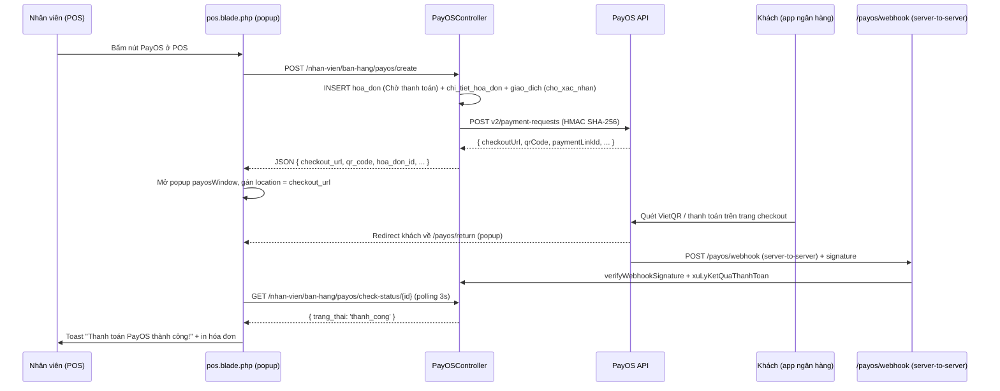

# Luồng thanh toán PayOS (VietQR) ở POS — Hướng dẫn

Tài liệu này mô tả toàn bộ luồng khi nhân viên bấm **"PayOS"** ở màn hình POS: API nào được gọi, file nào xử lý, nhân viên thấy gì, khách thấy gì, server cập nhật DB ra sao.

PayOS là cổng thanh toán tích hợp VietQR; sau khi tạo link, khách có thể quét QR bằng app ngân hàng bất kỳ (VCB, MB, ACB, Techcombank, ...) hoặc chọn phương thức khác trên trang checkout.

## 1. Sơ đồ luồng



## 2. Bước 1 — Nhân viên bấm "PayOS"

File: [resources/views/nhan_vien_view/pos.blade.php](resources/views/nhan_vien_view/pos.blade.php) (dòng 1176)

```html
<button class="pay-btn" data-method="payos" onclick="selectPayment('payos')">
    <i class="fas fa-qrcode"></i>
    PayOS
</button>
```

Trong `processPayment()` (dòng 1871):

```js
if (selectedPayment === 'payos') {
    await payosCreate();
    return;
}
```

Hàm `payosCreate()` (dòng 1982-2039):
1. Mở popup `payosWindow` đồng bộ để né popup-blocker.
2. `fetch POST /nhan-vien/ban-hang/payos/create` với cart + khách + khuyến mãi + điểm.
3. Redirect popup sang `data.checkout_url`.
4. Bắt đầu `payosStartPolling()` mỗi 3 giây.

Nếu popup bị chặn: nhân viên thấy toast lỗi "Trình duyệt chặn popup — hãy cho phép popup để thanh toán PayOS."

## 3. Bước 2 — BE tạo giao dịch

Route: [routes/web.php](routes/web.php)
```php
Route::post('/ban-hang/payos/create', [PayOSController::class, 'createPayment'])
    ->name('nhan-vien.ban-hang.payos.create');
```

File: [app/Http/Controllers/PayOSController.php](app/Http/Controllers/PayOSController.php) (dòng 22-128)

1. Validate cart/khách/khuyến mãi/điểm.
2. Tái sử dụng `NhanVienController::tinhTienDonHang()` để tính tiền.
3. INSERT `hoa_don` (trạng thái `Chờ thanh toán`, `phuong_thuc_thanh_toan='PayOS'`) + `chi_tiet_hoa_don` + `giao_dich` (trạng thái `cho_xac_nhan`, `phuong_thuc='payos'`, `ma_tham_chieu = id_hoa_don`).
4. Gọi `PayOSService::createPaymentLink($orderCode, $amount, $description)` — PayOS yêu cầu `orderCode` là integer duy nhất, ta dùng `id_hoa_don`.
5. Lưu `paymentLinkId`, `qrCode`, `checkoutUrl` vào `du_lieu_phan_hoi` của `giao_dich`.

Response JSON:
```json
{
  "success": true,
  "hoa_don_id": 123,
  "orderCode": 123,
  "checkout_url": "https://pay.payos.vn/web/abc...",
  "qr_code": "00020101021238570010A000000727...",
  "payment_link_id": "124c33293c934a85be5b7f8761a27a07",
  "amount": 30000,
  "expired_at": 1700000000
}
```

## 4. Bước 3 — PayOS trả về payment link

File: [app/Services/PayOSService.php](app/Services/PayOSService.php) (dòng 25-49)

```php
$this->payos->createPaymentLink(
    orderCode: $hoaDonId,
    amount: $amountVnd,
    description: 'DH ' . $hoaDonId,
);
```

- **API**: `POST https://api.payos.vn/v2/payment-requests`
- **Headers**: `x-client-id`, `x-api-key`, `Content-Type: application/json`
- **Body**: `{orderCode, amount, description, returnUrl, cancelUrl, expiredAt, signature}`
- **Signature** (HMAC SHA-256, sort alphabet): `amount=$amount&cancelUrl=$cancelUrl&description=$description&orderCode=$orderCode&returnUrl=$returnUrl`
- **Số tiền**: PayOS nhận VND nguyên (không nhân 100 như VNPay).

## 5. Bước 4 — Khách thanh toán, PayOS redirect về `/payos/return`

Route:
```php
Route::get('/payos/return', [PayOSController::class, 'return'])->name('payos.return');
```

Trong [PayOSController::return](app/Http/Controllers/PayOSController.php) (dòng 138-184):
1. Đọc `orderCode` từ query.
2. Gọi `PayOSService::getPaymentLink($orderCode)` để tra cứu trạng thái thực tế.
3. Nếu status = `PAID` và `amountPaid > 0`: idempotently gọi `xuLyKetQuaThanhToan` (đã thanh_cong thì bỏ qua).
4. Render [resources/views/nhan_vien_view/payment/payos-return.blade.php](resources/views/nhan_vien_view/payment/payos-return.blade.php).

View hiển thị kết quả, countdown 5 giây tự đóng popup, và gửi `postMessage({type: 'payos-return', success, verified, hoa_don_id, orderCode, cancelled})` về POS.

## 6. Bước 5 — Webhook cập nhật DB (nguồn chính thức)

Route:
```php
Route::post('/payos/webhook', [PayOSController::class, 'webhook'])->name('payos.webhook');
```

File: [PayOSController::webhook](app/Http/Controllers/PayOSController.php) (dòng 224-281)

Payload mẫu từ PayOS:
```json
{
  "code": "00",
  "desc": "success",
  "success": true,
  "data": {
    "orderCode": 123,
    "amount": 3000,
    "description": "VQRIO123",
    "accountNumber": "12345678",
    "reference": "TF230204212323",
    "transactionDateTime": "2023-02-04 18:25:00",
    "currency": "VND",
    "paymentLinkId": "124c33293c43417ab7879e14c8d9eb18",
    "code": "00",
    "desc": "Thành công"
  },
  "signature": "..."
}
```

Quy trình:
1. **Xác minh chữ ký** bằng `PayOSService::verifyWebhookSignature($data, $signature)` (HMAC SHA-256 sort alphabet). Sai → trả `code: '97'`.
2. Tìm `giao_dich` theo `orderCode`. Không thấy → `code: '01'`.
3. Đã thanh_cong trước đó → `code: '02'` (idempotent).
4. Số tiền không khớp → `code: '04'`.
5. Hoa đơn đã hủy → `code: '02'`.
6. Gọi `xuLyKetQuaThanhToan()` nếu `code === '00'` và `amount > 0` → cập nhật `hoa_don` thành `Hoàn thành`, trừ tồn kho, cộng/trừ điểm, ghi `lich_su_tich_diem`.
7. Trả `{code: '00', desc: 'Confirm Success'}`.

## 7. Bước 6 — POS polling phát hiện thành công

`payosStartPolling()` (dòng 2041-2081) gọi `GET /nhan-vien/ban-hang/payos/check-status/{id}` mỗi 3 giây, tối đa 5 phút:

```js
if (data.trang_thai === 'thanh_cong') {
    payosStopPolling();
    if (payosWindow && !payosWindow.closed) payosWindow.close();
    showToast('Thanh toán PayOS thành công!', 'success');
    closePaidInvoiceTab();
    loadProducts();
    showPrintInvoiceDialog(payosCurrentHoaDonId);
}
```

`postMessage` từ popup `/payos/return` (dòng 2091-2110): nhận về sớm hơn polling, chỉ dùng để báo "PayOS xác nhận, đang đồng bộ..." trong khi chờ webhook cập nhật DB.

## 8. Cấu hình cần thiết

File: [config/payos.php](config/payos.php) + `.env`:

```env
PAYOS_CLIENT_ID=...
PAYOS_API_KEY=...
PAYOS_CHECKSUM_KEY=...
PAYOS_RETURN_URL=https://your-domain.com/payos/return
PAYOS_CANCEL_URL=https://your-domain.com/payos/cancel
PAYOS_WEBHOOK_URL=https://your-domain.com/payos/webhook
PAYOS_EXPIRE_MINUTES=15
PAYOS_API_BASE=https://api.payos.vn
```

Lấy credentials tại [https://my.payos.vn](https://my.payos.vn) sau khi tạo Kênh thanh toán.

## 9. Lưu ý cho môi trường dev (localhost)

PayOS **chỉ gọi được webhook tới URL công khai**. Khi dev trên XAMPP/localhost:
- `PAYOS_WEBHOOK_URL` không nhận được → DB chỉ được cập nhật qua `/payos/return` (idempotent, an toàn).
- Dùng [ngrok](https://ngrok.com) hoặc Cloudflare Tunnel để trỏ PayOS về `https://abc.ngrok.io/payos/webhook`.
- Sau đó chạy `php artisan tinker` rồi gọi `(new App\Services\PayOSService)->confirmWebhook('https://abc.ngrok.io/payos/webhook')` để PayOS verify URL.

## 10. Hủy thanh toán

Khi khách chọn **Hủy** ở trang checkout PayOS → PayOS redirect về `/payos/cancel` → controller tự gọi `PayOSService::cancelPaymentLink()` và idempotently cập nhật DB thành `Thanh toán thất bại`.

## 11. FAQ

**Popup PayOS không mở?**
- Trình duyệt chặn popup. Bật popup cho domain POS rồi bấm lại.

**Thanh toán xong nhưng popup vẫn đang chờ?**
- Webhook chưa đến (localhost) hoặc chậm. Polling tối đa 5 phút. Nếu quá thời gian, POS sẽ báo "Đã hết thời gian chờ PayOS" — kiểm tra `giao_dich.trang_thai` rồi cập nhật thủ công nếu cần.

**Khách hủy trên trang PayOS?**
- Popup redirect về `/payos/cancel` → DB đánh dấu `Thanh toán thất bại`. POS hiển thị toast "Khách đã hủy thanh toán PayOS." Giỏ hàng vẫn nguyên.

**Số tiền bị lệch?**
- PayOS chỉ nhận VND nguyên, không nhân 100. `khach_can_tra` đã là VND rồi, controller dùng `(int) round((float) $calc['khach_can_tra'])`.

## 12. Bảng tổng hợp file

| File | Dòng | Vai trò |
|------|------|---------|
| [app/Http/Controllers/PayOSController.php](app/Http/Controllers/PayOSController.php) | 22-128 | `createPayment` - tạo giao dịch PayOS |
| [app/Http/Controllers/PayOSController.php](app/Http/Controllers/PayOSController.php) | 132-148 | `checkStatus` - polling từ POS |
| [app/Http/Controllers/PayOSController.php](app/Http/Controllers/PayOSController.php) | 156-207 | `return` - user-side callback |
| [app/Http/Controllers/PayOSController.php](app/Http/Controllers/PayOSController.php) | 212-238 | `cancel` - khi khách hủy |
| [app/Http/Controllers/PayOSController.php](app/Http/Controllers/PayOSController.php) | 244-298 | `webhook` - server-to-server (nguồn DB chính) |
| [app/Http/Controllers/PayOSController.php](app/Http/Controllers/PayOSController.php) | 304-405 | `xuLyKetQuaThanhToan` - cập nhật DB idempotent |
| [app/Http/Controllers/PayOSController.php](app/Http/Controllers/PayOSController.php) | 407-426 | `truTonKho` - trừ tồn kho theo biến thể |
| [app/Services/PayOSService.php](app/Services/PayOSService.php) | 25-49 | `createPaymentLink` |
| [app/Services/PayOSService.php](app/Services/PayOSService.php) | 56-65 | `getPaymentLink` |
| [app/Services/PayOSService.php](app/Services/PayOSService.php) | 71-82 | `cancelPaymentLink` |
| [app/Services/PayOSService.php](app/Services/PayOSService.php) | 90-95 | `verifyWebhookSignature` |
| [app/Services/PayOSService.php](app/Services/PayOSService.php) | 100-117 | `signCreatePayload` |
| [app/Services/PayOSService.php](app/Services/PayOSService.php) | 119-141 | `buildSortedQuery` + sort đệ quy |
| [app/Models/GiaoDich.php](app/Models/GiaoDich.php) | 18 | Hằng số `PHUONG_THUC_PAYOS = 'payos'` |
| [database/migrations/2026_07_29_000001_add_payos_to_giao_dich_table.php](database/migrations/2026_07_29_000001_add_payos_to_giao_dich_table.php) | toàn file | Thêm enum `'payos'` |
| [routes/web.php](routes/web.php) | - | 5 route PayOS |
| [bootstrap/app.php](bootstrap/app.php) | - | Bỏ CSRF cho `/payos/webhook` |
| [config/payos.php](config/payos.php) | toàn file | Cấu hình PayOS |
| [.env](.env) | - | Biến `PAYOS_*` |
| [resources/views/nhan_vien_view/pos.blade.php](resources/views/nhan_vien_view/pos.blade.php) | 1176 | Nút "PayOS" |
| [resources/views/nhan_vien_view/pos.blade.php](resources/views/nhan_vien_view/pos.blade.php) | 1871 | Rẽ nhánh `processPayment` |
| [resources/views/nhan_vien_view/pos.blade.php](resources/views/nhan_vien_view/pos.blade.php) | 1982-2039 | `payosCreate()` |
| [resources/views/nhan_vien_view/pos.blade.php](resources/views/nhan_vien_view/pos.blade.php) | 2041-2081 | `payosStartPolling()` |
| [resources/views/nhan_vien_view/pos.blade.php](resources/views/nhan_vien_view/pos.blade.php) | 2091-2110 | Lắng nghe `postMessage` |
| [resources/views/nhan_vien_view/payment/payos-return.blade.php](resources/views/nhan_vien_view/payment/payos-return.blade.php) | toàn file | Trang return/cancel |