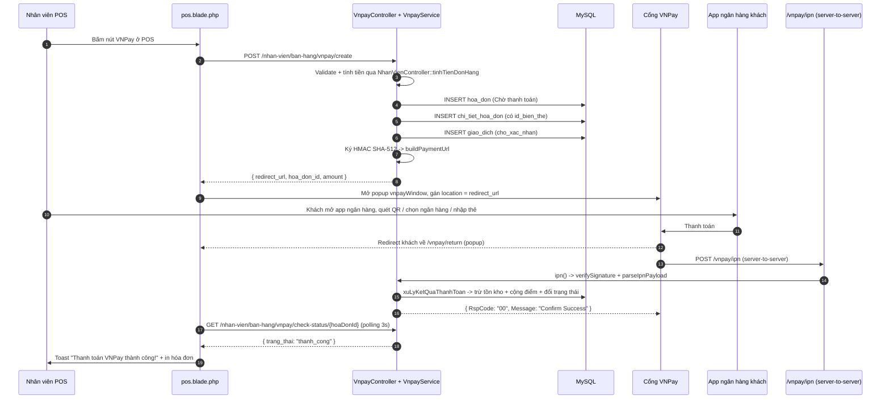
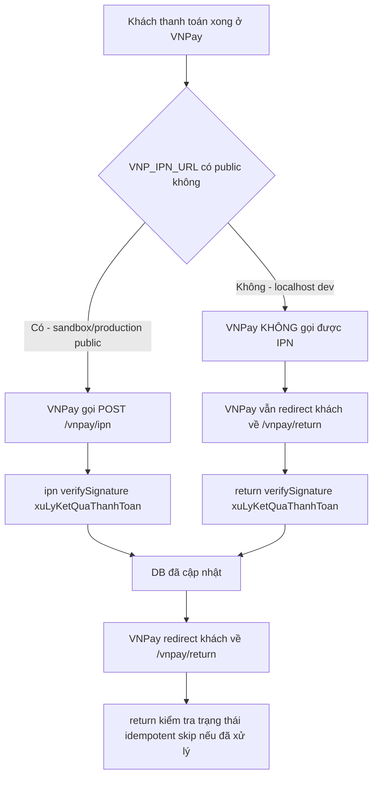

# Luồng thanh toán VNPay ở POS — Hướng dẫn

Tài liệu này mô tả toàn bộ luồng khi nhân viên bấm **"VNPay"** ở màn hình POS: API nào được gọi, file nào xử lý, nhân viên thấy gì, khách thấy gì, server cập nhật DB ra sao.

Đối tượng đọc:
- **Nhân viên bán hàng**: hiểu các bước vận hành và xử lý khi gặp sự cố.
- **Dev bảo trì**: tra cứu nhanh khi cần đọc lại luồng hoặc debug.

---

## 1. Tổng quan luồng



---

## 2. Bước 1 — Nhân viên bấm "VNPay"

**File liên quan:** [resources/views/nhan_vien_view/pos.blade.php](resources/views/nhan_vien_view/pos.blade.php)

- **Dòng 1176**: nút chọn phương thức thanh toán
  ```html
  <button class="pay-btn" data-method="vnpay" onclick="selectPayment('vnpay')">
      <i class="fas fa-qrcode"></i>
      VNPay
  </button>
  ```
  Nút này nằm trong khối `.payment-methods`, cạnh **Tiền mặt** và **Chuyển khoản**.

- **Dòng 1871-1874**: khi nhân viên bấm **F9 / "Thanh toán"**, hàm `processPayment()` rẽ nhánh theo `selectedPayment`:
  ```javascript
  if (selectedPayment === 'vnpay') {
      await vnpayCreate();
      return;
  }
  ```

- **Dòng 1996**: `vnpayCreate()` mở popup trắng `vnpayWindow` (kích thước 900x700) để lát nữa redirect khách sang cổng VNPay:
  ```javascript
  vnpayWindow = window.open('about:blank', 'vnpayWindow', 'width=900,height=700,left=200,top=100');
  ```

**Nhân viên thấy gì:**
- Trên POS: giao diện POS vẫn hiển thị bình thường, có thể thấy toast "Đang tạo giao dịch VNPay..." trong giây lát.
- Một **popup trắng** bật ra (900x700 px, vị trí cách trái 200 px, cách trên 100 px). Popup này chưa có nội dung, sẽ được gán URL thanh toán ở bước 3.
- Nếu trình duyệt **chặn popup**, nhân viên thấy toast lỗi "Trình duyệt chặn popup — hãy cho phép popup để thanh toán VNPay." — phải bật popup cho domain POS rồi bấm lại.

---

## 3. Bước 2 — FE gọi API `POST /nhan-vien/ban-hang/vnpay/create`

**Route:** [routes/web.php](routes/web.php) dòng 410

```php
Route::post('/ban-hang/vnpay/create', [VnpayController::class, 'createPayment'])
    ->name('nhan-vien.ban-hang.vnpay.create');
```

**Payload FE gửi** (từ `pos.blade.php`):
```json
{
  "cart": [{ "id": 12, "qty": 2 }],
  "id_khach_hang": 5,
  "id_khuyen_mai": null,
  "diem_su_dung": 0,
  "bank_code": null
}
```

**Controller xử lý:** [VnpayController::createPayment](app/Http/Controllers/VnpayController.php) (dòng 26-205)

Các bước chính:

1. **Validate** (dòng 28-36): kiểm tra giỏ hàng, biến thể tồn tại, khách/khuyến mãi hợp lệ.
2. **Tính tiền** (dòng 39-44): gọi lại `NhanVienController::tinhTienDonHang($request)` để có cùng kết quả như thanh toán tiền mặt/chuyển khoản (tổng tiền hàng, khuyến mãi, điểm thưởng, khách cần trả).
3. **Insert `hoa_don`** (dòng 49-65): trạng thái `Chờ thanh toán`, `phuong_thuc_thanh_toan = 'VNPay'`, `khach_can_tra = tien_khach_dua = số tiền cần thanh toán`, `tien_thua = 0`.
4. **Insert `chi_tiet_hoa_don`** (dòng 67-79): có cả `id_san_pham` (cha) lẫn `id_bien_the` (biến thể con). Cột `id_bien_the` được thêm bởi migration [2026_07_19_000002_add_id_bien_the_to_chi_tiet_hoa_don_table.php](database/migrations/2026_07_19_000002_add_id_bien_the_to_chi_tiet_hoa_don_table.php) để trừ đúng tồn kho theo biến thể khi IPN xác nhận.
5. **Insert `giao_dich`** (dòng 81-92): trạng thái `cho_xac_nhan` (chờ xác nhận), `ma_tham_chieu = id_hoa_don` (dùng làm `vnp_TxnRef`), lưu kèm `bank_code_request` và `created_from = 'pos'` vào `du_lieu_phan_hoi`.
6. **Build URL thanh toán** (dòng 98-104): gọi `VnpayService::buildPaymentUrl(...)` để sinh URL redirect sang cổng VNPay có kèm `vnp_SecureHash`.

**Response FE nhận:**
```json
{
  "success": true,
  "hoa_don_id": 123,
  "redirect_url": "https://sandbox.vnpayment.vn/paymentv2/vpcpay.html?vnp_Amount=...&vnp_SecureHash=...",
  "form_html": "<form id=\"vnpayAutoForm\" method=\"POST\" ...></form>",
  "amount": 250000
}
```

---

## 4. Bước 3 — Popup redirect sang cổng VNPay

**File liên quan:** [pos.blade.php](resources/views/nhan_vien_view/pos.blade.php) dòng 2038-2041

```javascript
if (vnpayWindow && !vnpayWindow.closed) {
    vnpayWindow.location = data.redirect_url;
}
```

Popup trắng lúc nãy giờ được chuyển đến URL cổng VNPay.

**URL thanh toán** có 13 tham số theo chuẩn VNPay, sinh bởi [VnpayService::buildPaymentUrl](app/Services/VnpayService.php) (dòng 17-62):

| Tham số | Ý nghĩa |
|---|---|
| `vnp_Version` | Phiên bản API (mặc định `2.1.0`) |
| `vnp_Command` | Lệnh thanh toán (`pay`) |
| `vnp_TmnCode` | Mã định danh merchant (cấu hình `config/vnpay.php` -> `VNP_TMNCODE`) |
| `vnp_Amount` | Số tiền × 100 (VNPay yêu cầu đơn vị nhỏ nhất của VND) |
| `vnp_CreateDate` | Thời điểm tạo URL, format `YmdHis` |
| `vnp_ExpireDate` | Thời điểm hết hạn, mặc định `+15 phút` |
| `vnp_CurrCode` | Loại tiền (`VND`) |
| `vnp_IpAddr` | IP khách hàng (ghi nhận ở VNPay) |
| `vnp_Locale` | Ngôn ngữ (`vn` / `en`) |
| `vnp_OrderInfo` | Nội dung thanh toán (đã `sanitize`) |
| `vnp_OrderType` | Loại đơn hàng (`other`) |
| `vnp_ReturnUrl` | URL VNPay redirect khách về sau thanh toán |
| `vnp_TxnRef` | Mã tham chiếu = `id_hoa_don` (unique per attempt) |
| `vnp_BankCode` *(tùy chọn)* | Mã ngân hàng (gợi ý sẵn: `VNPAYQR` để hiện QR ngay) |
| `vnp_SecureHash` | Chữ ký HMAC SHA-512 ký trên chuỗi hashdata sort theo alphabet |

**Khách thấy gì:**
- Giao diện cổng VNPay (sandbox: `https://sandbox.vnpayment.vn/paymentv2/vpcpay.html`):
  - **Tiêu đề đơn hàng**: nội dung từ `vnp_OrderInfo`.
  - **Số tiền**: hiển thị bằng `vnp_Amount / 100`.
  - **Danh sách ngân hàng / ví QR / thẻ nội địa / thẻ quốc tế** để khách chọn.
  - Nếu `vnp_BankCode = VNPAYQR`: khách thấy luôn QR code để quét bằng app ngân hàng/VNPay.
  - Nếu `vnp_BankCode = VCB / NCB / ...`: khách thấy luôn QR của ngân hàng tương ứng.
  - Nếu để trống: cổng VNPay hiện danh sách để khách tự chọn.

**Lưu ý quan trọng về `vnp_OrderInfo`** ([VnpayService::sanitizeOrderInfo](app/Services/VnpayService.php) dòng 117-132):
- VNPay docs chỉ chấp nhận **Alphanumeric[1,255]** (Tiếng Anh hoặc Tiếng Việt không dấu).
- Mọi ký tự ngoài `A-Za-z0-9`, khoảng trắng, gạch ngang, gạch dưới sẽ bị thay bằng khoảng trắng.
- **Đặc biệt**: ký tự `: # & = % + / \ ?` đều gây **lỗi 03 (Invalid data format)** ở sandbox.
- Đó là lý do mặc định `vnp_OrderInfo = 'Thanh toan GD:123'` thay vì `Thanh toán GD:123` (bỏ dấu) hay `Thanh toán GD#123` (bỏ `#`).

---

## 5. Bước 4 — Khách thanh toán xong, VNPay redirect về `/vnpay/return`

**Route:** [routes/web.php](routes/web.php) dòng 434

```php
Route::get('/vnpay/return', [VnpayController::class, 'return'])->name('vnpay.return');
```

**Controller:** [VnpayController::return](app/Http/Controllers/VnpayController.php) (dòng 249-282)

Xử lý:
1. **Verify chữ ký** bằng [VnpayService::verifySignature](app/Services/VnpayService.php) (dòng 138-155) — tính lại `vnp_SecureHash` từ các param nhận được, so sánh với chữ ký VNPay gửi. Nếu lệch -> `verified = false`.
2. **Fallback cập nhật DB** (dòng 257-271): nếu server đang chạy localhost và VNPay không gọi được IPN, `return()` vẫn cập nhật DB luôn. Method `xuLyKetQuaThanhToan` là **idempotent** (gọi 2 lần return + ipn vẫn an toàn).
3. **Render view** [resources/views/nhan_vien_view/payment/vnpay-return.blade.php](resources/views/nhan_vien_view/payment/vnpay-return.blade.php).

**Khách thấy gì ở trang `/vnpay/return`:**
- **Nếu thành công**: nền xanh lá, icon ✓, tiêu đề "Thanh toán thành công!", bảng chi tiết (mã hóa đơn, số tiền, mã GD VNPay, ngân hàng, thời gian, mã phản hồi), nút "Đóng cửa sổ", đếm ngược **5 giây tự đóng** và gửi `postMessage({type: 'vnpay-return', success: true, verified: true, hoa_don_id: ...})` về POS.
- **Nếu thất bại**: nền đỏ, icon ✕, tiêu đề "Thanh toán thất bại" / "Chữ ký không hợp lệ", nút "Đóng cửa sổ".

---

## 6. Bước 5 — POS nhận tín hiệu thành công

**File liên quan:** [pos.blade.php](resources/views/nhan_vien_view/pos.blade.php)

Hệ thống có **2 nguồn tín hiệu song song** để chắc chắn POS luôn cập nhật dù popup có đóng hay không:

### 6.1. Polling trạng thái

**Route:** [routes/web.php](routes/web.php) dòng 412 → [VnpayController::checkStatus](app/Http/Controllers/VnpayController.php) dòng 223-244

`vnpayStartPolling()` (dòng 2090-2146) chạy `setInterval` mỗi **3 giây**, tối đa **5 phút**:

```javascript
vnpayPollTimer = setInterval(async () => {
    const response = await fetch('/nhan-vien/ban-hang/vnpay/check-status/' + vnpayCurrentHoaDonId);
    const data = await response.json();
    if (data.trang_thai === 'thanh_cong') {
        vnpayStopPolling();
        vnpayWindow.close();
        showToast('Thanh toán VNPay thành công!', 'success');
        closePaidInvoiceTab();
        loadProducts();
        showPrintInvoiceDialog(vnpayCurrentHoaDonId);
    } else if (data.trang_thai === 'that_bai' || data.trang_thai === 'hoan_tien') {
        vnpayStopPolling();
        vnpayWindow.close();
        showToast('Thanh toán VNPay thất bại.', 'error');
    }
}, 3000);
```

Khi `trang_thai === 'thanh_cong'` (dòng 2128-2135):
1. **Dừng polling**.
2. **Đóng popup VNPay**.
3. **Toast "Thanh toán VNPay thành công!"**.
4. **Đóng tab hóa đơn đang thanh toán** (`closePaidInvoiceTab`).
5. **Load lại danh sách sản phẩm** (`loadProducts`) để cập nhật tồn kho.
6. **Hiện dialog in hóa đơn** (`showPrintInvoiceDialog`).

### 6.2. postMessage từ popup `/vnpay/return`

`pos.blade.php` dòng 2156-2189 lắng nghe `window.message` từ popup:

```javascript
window.addEventListener('message', function (event) {
    if (event.data.type !== 'vnpay-return' && event.data.type !== 'vnpay_returned') return;
    if (parseInt(event.data.hoa_don_id) !== parseInt(vnpayCurrentHoaDonId)) return;

    if (event.data.success && event.data.verified) {
        showToast('VNPay xác nhận thanh toán, đang đồng bộ...', 'info');
    } else {
        vnpayStopPolling();
        showToast('Thanh toán VNPay chưa hoàn tất.', 'error');
    }
});
```

Tin nhắn được gửi từ `vnpay-return.blade.php` (dòng 166-173) khi popup tự đóng sau 5 giây.

**Nhân viên thấy gì ở bước này:**
- Toast xanh "Thanh toán VNPay thành công!" trên POS.
- Popup VNPay tự đóng.
- Tab hóa đơn đang thanh toán được đóng, quay về màn hình POS chính.
- Dialog in hóa đơn tự động bật lên để in bill cho khách.

---

## 7. Bước 6 — Server-to-server IPN (nguồn cập nhật chính thức)

**Route:** [routes/web.php](routes/web.php) dòng 435

```php
Route::post('/vnpay/ipn', [VnpayController::class, 'ipn'])->name('vnpay.ipn');
```

**Controller:** [VnpayController::ipn](app/Http/Controllers/VnpayController.php) dòng 287-347

Đây là nguồn cập nhật **chính thức** từ VNPay, server-to-server, **không phụ thuộc vào khách** (kể cả khách đóng popup trước khi thanh toán xong thì DB vẫn được cập nhật).

Xử lý:
1. **Verify chữ ký** (dòng 289-294): nếu sai -> trả `{RspCode: '97', Message: 'Invalid signature'}`.
2. **Tìm `giao_dich`** theo `vnp_TxnRef` (dòng 298-301): nếu không thấy -> `RspCode: '01'`.
3. **Kiểm tra đã confirm chưa** (dòng 310-315): nếu đã `thanh_cong` -> `RspCode: '02'`.
4. **Kiểm tra số tiền** (dòng 317-322): so khớp `vnp_Amount / 100` với `giao_dich.so_tien`, chênh lệch > 0.01 -> `RspCode: '04'`.
5. **Kiểm tra hóa đơn** (dòng 324-330): nếu đã hủy -> `RspCode: '02'`.
6. **Cập nhật DB** qua `xuLyKetQuaThanhToan` (dòng 335).
7. **Trả `{RspCode: '00', Message: 'Confirm Success'}`** để VNPay biết đã nhận.

### Bảng `RspCode` VNPay:

| RspCode | Ý nghĩa | VNPay có gọi lại không |
|---|---|---|
| `00` | Confirm Success | Không |
| `01` | Order not found | Có |
| `02` | Order already confirmed / cancelled | Không |
| `04` | Invalid amount | Có |
| `97` | Invalid signature | Có |

### `xuLyKetQuaThanhToan` (dòng 380-465) làm gì:

**Trường hợp thành công** (`isSuccess = true`):
- Cập nhật `giao_dich`:
  - `trang_thai = 'thanh_cong'`.
  - `ma_giao_dich_doi_tac = vnp_TransactionNo` (đã chuẩn hóa qua `normalizeTxnNo` — null nếu rỗng hoặc `'0'` để tránh lỗi UNIQUE 1062).
  - `ma_phan_hoi = vnp_ResponseCode`.
  - `trang_thai_doi_tac = vnp_TransactionStatus`.
  - `ma_ngan_hang = vnp_BankCode`.
  - `ngay_gio_thanh_toan` (parse `vnp_PayDate` từ `YmdHis`).
- **Trừ tồn kho** qua `truTonKho` (dòng 467-486): duyệt `chi_tiet_hoa_don`, đọc `id_bien_the` (cột mới ở migration `2026_07_19_000002`), gọi `decrement('so_luong_ton')` trên `bien_the_san_pham`.
- Đổi `hoa_don.trang_thai = 'Hoàn thành'`, `diem_thu_duoc = khach_can_tra / 10000`.
- Nếu có `id_khach_hang`: cập nhật `khach_hang.diem_tich_luy = diem_tich_luy - diem_su_dung + diem_thu_duoc`, `tong_chi_tieu += khach_can_tra`. Ghi `lich_su_tich_diem` (loại `tru` cho phần sử dụng điểm, loại `cong` cho phần tích điểm mới).

**Trường hợp thất bại** (`isSuccess = false`):
- `giao_dich.trang_thai = 'that_bai'`.
- `hoa_don.trang_thai = 'Thanh toán thất bại'`.
- **Không trừ tồn kho, không cộng điểm.**

---

## 8. Bảng tóm tắt file liên quan

| File | Dòng | Vai trò |
|---|---|---|
| [routes/web.php](routes/web.php) | 410 | Route `POST /ban-hang/vnpay/create` |
| [routes/web.php](routes/web.php) | 412 | Route `GET /ban-hang/vnpay/check-status/{id}` |
| [routes/web.php](routes/web.php) | 434 | Route `GET /vnpay/return` |
| [routes/web.php](routes/web.php) | 435 | Route `POST /vnpay/ipn` |
| [resources/views/nhan_vien_view/pos.blade.php](resources/views/nhan_vien_view/pos.blade.php) | 1176 | Nút bấm "VNPay" ở POS |
| [resources/views/nhan_vien_view/pos.blade.php](resources/views/nhan_vien_view/pos.blade.php) | 1871-1874 | `processPayment()` rẽ nhánh VNPay |
| [resources/views/nhan_vien_view/pos.blade.php](resources/views/nhan_vien_view/pos.blade.php) | 1983-2088 | Hàm `vnpayCreate()` |
| [resources/views/nhan_vien_view/pos.blade.php](resources/views/nhan_vien_view/pos.blade.php) | 2038-2041 | Popup redirect sang cổng VNPay |
| [resources/views/nhan_vien_view/pos.blade.php](resources/views/nhan_vien_view/pos.blade.php) | 2090-2146 | `vnpayStartPolling()` + xử lý kết quả |
| [resources/views/nhan_vien_view/pos.blade.php](resources/views/nhan_vien_view/pos.blade.php) | 2156-2189 | Lắng nghe `postMessage` từ popup |
| [resources/views/nhan_vien_view/payment/vnpay-return.blade.php](resources/views/nhan_vien_view/payment/vnpay-return.blade.php) | toàn file | Trang VNPay redirect khách về |
| [app/Http/Controllers/VnpayController.php](app/Http/Controllers/VnpayController.php) | 26-205 | `createPayment` — nhận yêu cầu từ POS |
| [app/Http/Controllers/VnpayController.php](app/Http/Controllers/VnpayController.php) | 223-244 | `checkStatus` — phục vụ polling |
| [app/Http/Controllers/VnpayController.php](app/Http/Controllers/VnpayController.php) | 249-282 | `return` — user-side callback |
| [app/Http/Controllers/VnpayController.php](app/Http/Controllers/VnpayController.php) | 287-347 | `ipn` — server-to-server callback |
| [app/Http/Controllers/VnpayController.php](app/Http/Controllers/VnpayController.php) | 380-465 | `xuLyKetQuaThanhToan` — cập nhật DB (idempotent) |
| [app/Http/Controllers/VnpayController.php](app/Http/Controllers/VnpayController.php) | 467-486 | `truTonKho` — dùng `id_bien_the` |
| [app/Services/VnpayService.php](app/Services/VnpayService.php) | 17-62 | `buildPaymentUrl` — sinh URL + ký HMAC |
| [app/Services/VnpayService.php](app/Services/VnpayService.php) | 70-107 | `buildPaymentFormHtml` — sinh form auto-submit (fallback) |
| [app/Services/VnpayService.php](app/Services/VnpayService.php) | 117-132 | `sanitizeOrderInfo` — tránh lỗi 03 |
| [app/Services/VnpayService.php](app/Services/VnpayService.php) | 138-155 | `verifySignature` — xác thực chữ ký |
| [app/Services/VnpayService.php](app/Services/VnpayService.php) | 162-180 | `extractVnpParams` |
| [app/Services/VnpayService.php](app/Services/VnpayService.php) | 190-226 | `buildHashData` — chuẩn hashdata |
| [app/Services/VnpayService.php](app/Services/VnpayService.php) | 233-252 | `parseIpnPayload` — chuẩn hóa payload IPN |
| [config/vnpay.php](config/vnpay.php) | toàn file | Cấu hình VNPay (TmnCode, HashSecret, URLs, expire...) |
| [database/migrations/2026_07_19_000002_add_id_bien_the_to_chi_tiet_hoa_don_table.php](database/migrations/2026_07_19_000002_add_id_bien_the_to_chi_tiet_hoa_don_table.php) | toàn file | Migration thêm cột `id_bien_the` để trừ tồn kho đúng biến thể |

---

## 9. Sơ đồ phụ — fallback khi IPN không reach được server



**Ghi chú:**
- Trên localhost (XAMPP), VNPay không gọi được IPN vì URL `http://127.0.0.1:8000/vnpay/ipn` không public.
- `return()` đã được thiết kế để **fallback** cập nhật DB luôn (dòng 257-271 trong `VnpayController.php`).
- Tuy nhiên fallback chỉ chạy khi khách **không đóng popup quá nhanh**. Đó là lý do cần polling từ POS.

---

## 10. FAQ cho nhân viên

### Khách bấm Hủy ở VNPay thì sao?
- Popup VNPay redirect về `/vnpay/return?response_code=24&...` (mã hủy).
- `return()` xử lý nhưng `isSuccess = false` -> `giao_dich.trang_thai = 'that_bai'`, `hoa_don.trang_thai = 'Thanh toán thất bại'`.
- Polling phát hiện `trang_thai === 'that_bai'` -> đóng popup, toast đỏ "Thanh toán VNPay thất bại."
- POS vẫn giữ giỏ hàng, nhân viên có thể bấm lại VNPay hoặc chuyển sang Tiền mặt/Chuyển khoản.

### Trình duyệt chặn popup thì sao?
- Nhân viên thấy toast "Trình duyệt chặn popup — hãy cho phép popup để thanh toán VNPay."
- Cách xử lý: click icon popup bị chặn ở thanh địa chỉ trình duyệt → "Cho phép popup từ localhost" → bấm lại F9.

### QR hết hạn 15 phút?
- `vnp_ExpireDate = vnp_CreateDate + 15 phút` (xem `VnpayService::buildPaymentUrl` dòng 28-29).
- Sau 15 phút, URL thanh toán không hợp lệ nữa, cổng VNPay sẽ báo lỗi.
- POS có `deadline = Date.now() + 5 * 60 * 1000` trong `vnpayStartPolling` (dòng 2094) — sau 5 phút polling tự dừng, toast "Đã hết thời gian chờ VNPay."
- Giải pháp: bấm lại VNPay để tạo giao dịch mới (hoặc sang phương thức khác).

### Thanh toán thành công nhưng POS vẫn chờ?
- Nguyên nhân thường gặp: popup `/vnpay/return` chưa redirect về kịp, polling phát hiện sau 3 giây.
- Nếu sau 5 phút vẫn chờ: kiểm tra bảng `giao_dich` xem đã `thanh_cong` chưa. Nếu DB đã cập nhật mà POS không nhận -> reload trang POS (Ctrl+F5).

### Khách đã trả tiền nhưng bill báo thất bại?
- Rất hiếm. Có thể do IPN không reach được server (localhost) và khách đóng popup quá nhanh.
- Kiểm tra DB: nếu `giao_dich.trang_thai = 'thanh_cong'` -> DB đúng, chỉ cần in lại hóa đơn cho khách.
- Nếu `giao_dich.trang_thai` vẫn `cho_xac_nhan` mà khách khẳng định đã trả: liên hệ admin để tra cứu giao dịch qua API VNPay (`config/vnpay.api_url`).

### Cộng điểm khách hàng hoạt động ra sao?
- `diem_thu_duoc = floor(khach_can_tra / 10000)` — cứ 100.000đ được 10 điểm.
- Nếu khách có dùng điểm: `khach_hang.diem_tich_luy = diem_cu - diem_su_dung + diem_thu_duoc`.
- `khach_hang.tong_chi_tieu += khach_can_tra`.
- Lịch sử biến động điểm được ghi vào `lich_su_tich_diem` (loại `cong` / `tru`).

### Tồn kho được trừ ở đâu?
- Trong `truTonKho()` (dòng 467-486), sau khi IPN xác nhận thành công.
- Duyệt `chi_tiet_hoa_don` của hóa đơn, đọc `id_bien_the` (cột mới), `decrement('so_luong_ton')` trên `bien_the_san_pham`.
- **Chỉ trừ khi IPN/return xác nhận thành công** — không trừ tồn kho lúc tạo `hoa_don` ở trạng thái `Chờ thanh toán`.
- Nếu hủy đơn ở trạng thái `Chờ thanh toán`: tồn kho không cần hoàn (vì chưa trừ).

---

## Phụ lục: cấu hình VNPay

Các biến môi trường đọc từ `.env` qua [config/vnpay.php](config/vnpay.php):

| Key .env | Mặc định | Ý nghĩa |
|---|---|---|
| `VNP_TMNCODE` | (rỗng) | Mã merchant VNPay cấp |
| `VNP_HASH_SECRET` | (rỗng) | Secret key ký và xác thực chữ ký |
| `VNP_URL` | `https://sandbox.vnpayment.vn/paymentv2/vpcpay.html` | URL cổng thanh toán (sandbox/production) |
| `VNP_RETURN_URL` | `http://127.0.0.1:8000/vnpay/return` | URL khách redirect về |
| `VNP_IPN_URL` | `http://127.0.0.1:8000/vnpay/ipn` | URL server-to-server IPN |
| `VNP_API_URL` | `https://sandbox.vnpayment.vn/merchant_webapi/api/transaction` | URL API tra cứu / hoàn tiền |
| `VNP_VERSION` | `2.1.0` | Phiên bản API |
| `VNP_COMMAND` | `pay` | Lệnh thanh toán |
| `VNP_CURRENCY` | `VND` | Loại tiền |
| `VNP_ORDER_TYPE` | `other` | Loại đơn hàng |
| `VNP_LOCALE` | `vn` | Ngôn ngữ |
| `VNP_EXPIRE_MINUTES` | `15` | Số phút hết hạn URL thanh toán |